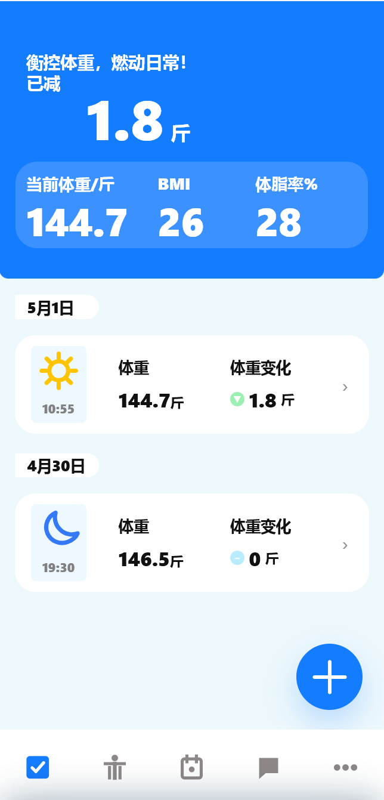
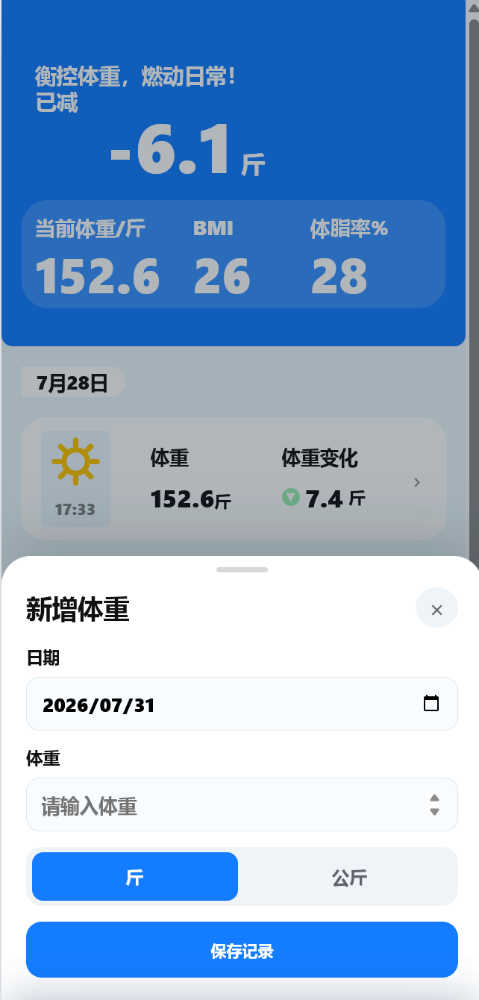
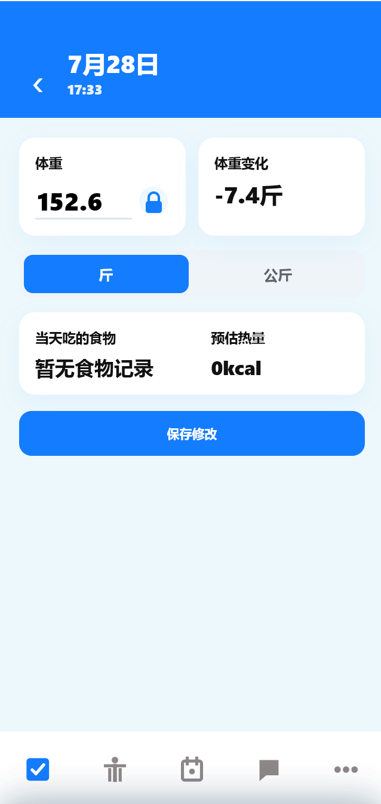
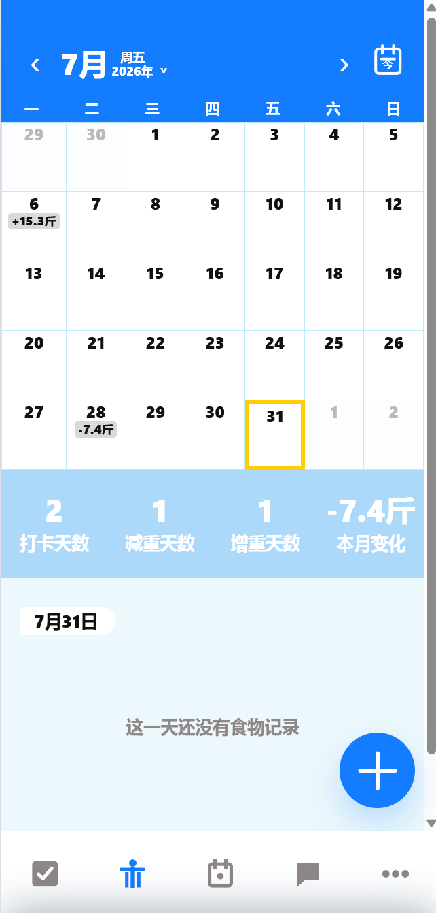
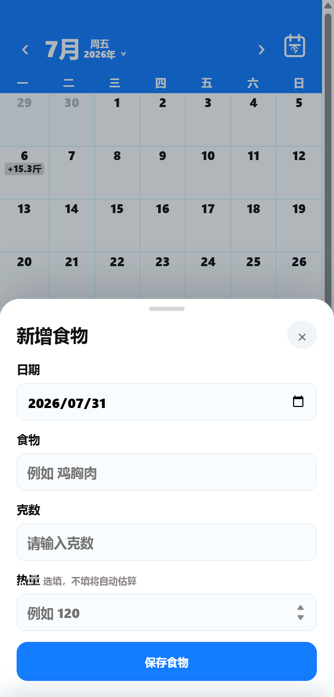
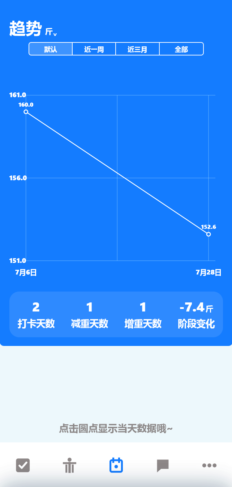
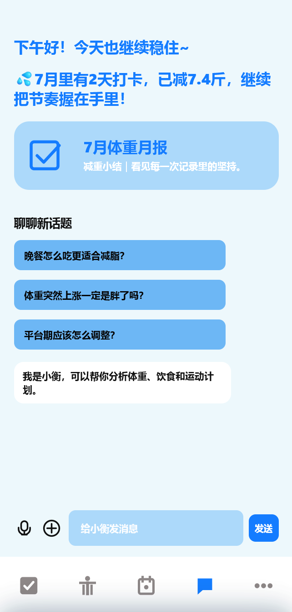
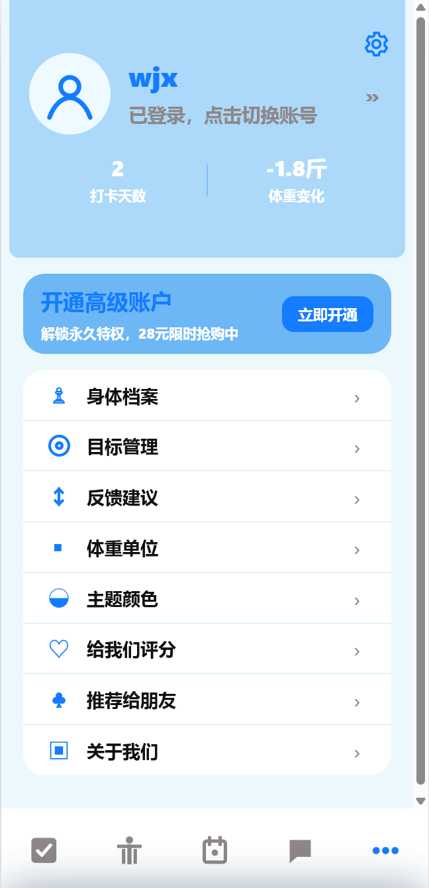

# 衡燃 Hengran - 体重管理与 AI 助手产品项目

这是一个面向求职展示的产品经理作品集项目。项目围绕“体重记录、饮食记录、趋势分析、AI 减重助手”展开，包含可本地运行的前后端 Demo、产品需求文档、产品调研文档和原型截图。

项目作者：王嘉鑫  
联系邮箱：3047307762@qq.com

## 项目简介

衡燃是一款面向减重用户的体重管理工具。用户可以记录体重和饮食，查看体重趋势，并通过“小衡 AI 助手”咨询体重变化、饮食热量、减脂方法和平台期调整等问题。

项目核心目标是把单纯的数据记录工具，升级为具备数据解释、阶段复盘和情绪陪伴能力的智能减重助手。

## 已实现功能

- 体重记录：首页展示当前体重、BMI、已减重和打卡记录。
- 饮食记录：支持记录食物、克数和热量，并在日历中同步展示。
- 趋势分析：根据体重记录生成趋势图，支持不同时间范围查看。
- 小衡 AI 助手：支持推荐话题、AI 对话、月报卡片和顶部问候话术。
- 个人中心：支持用户资料、目标管理、反馈建议等基础设置。
- 后端能力：支持本地账号体系、SQLite 数据存储和接口调用。

## 如何查看项目

### 1. 克隆项目

```bash
git clone https://github.com/3047307762-afk/hengran.git
cd hengran
```

### 2. 启动本地服务

项目使用 Python 内置后端服务，本地运行即可查看 Demo：

```bash
python server.py
```

### 3. 打开浏览器访问

```text
http://localhost:5174
```

建议使用浏览器开发者工具切换到手机尺寸查看页面效果。

## 项目文档

| 文档 | 说明 |
|---|---|
| [【产品文档】AI助手.docx](文档/【产品文档】AI助手.docx) | 小衡 AI 助手功能需求文档，包含需求背景、产品目标、需求说明、异常状态和数据埋点。 |
| [【产品调研】AI助手.docx](文档/【产品调研】AI助手.docx) | AI 助手竞品调研文档，调研 Sigma、OMY！Sports、Keep、ego、ChattyFit 等产品。 |

## 原型截图

### 体重记录相关






### 饮食记录相关




### 趋势、AI 助手与个人中心





## 目录说明

```text
hengran/
├─ index.html          # Web 原型页面
├─ styles.css          # 页面样式
├─ app.js              # 前端交互逻辑
├─ server.py           # Python 后端服务
├─ assets/             # 项目图片资源
├─ 文档/               # 产品文档、调研文档和原型截图
└─ README.md           # 项目说明
```

## 项目亮点

- 从产品调研、原型设计到前后端 Demo 实现，形成了较完整的产品闭环。
- AI 助手不是简单聊天框，而是结合体重、饮食和趋势数据的减重陪伴入口。
- 文档中包含 PRD、竞品分析、功能拆解、异常状态和数据埋点，更贴近真实产品工作流程。
- Demo 支持本地运行，便于面试时直接展示交互效果。

## 联系方式

如需了解项目思路、产品文档或演示流程，可以联系：

王嘉鑫  
邮箱：3047307762@qq.com
